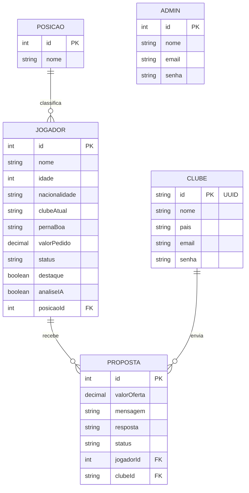

# Modelo Entidade-Relacionamento — transferBID

Diagrama das 5 tabelas do sistema (4 relacionadas e Admin isolada) (Posicao, Jogador, Clube, Proposta e Admin),
gerado a partir do `back/prisma/schema.prisma`. O GitHub renderiza o bloco abaixo
automaticamente como diagrama.

## Observações

- **Posicao → Jogador → Proposta ← Clube** formam as 4 tabelas relacionadas exigidas
  pelo trabalho (requisito mínimo).
- **Admin** não possui relação com as demais tabelas — ela é isolada de propósito,
  já que representa o acesso da equipe da agência, não um dado de negócio do domínio.
- O campo `analiseIA` (boolean) foi adicionado depois da modelagem inicial para
  distinguir jogadores com análise real da IA (Gemini) dos que ainda têm apenas
  dados ilustrativos de exemplo.
